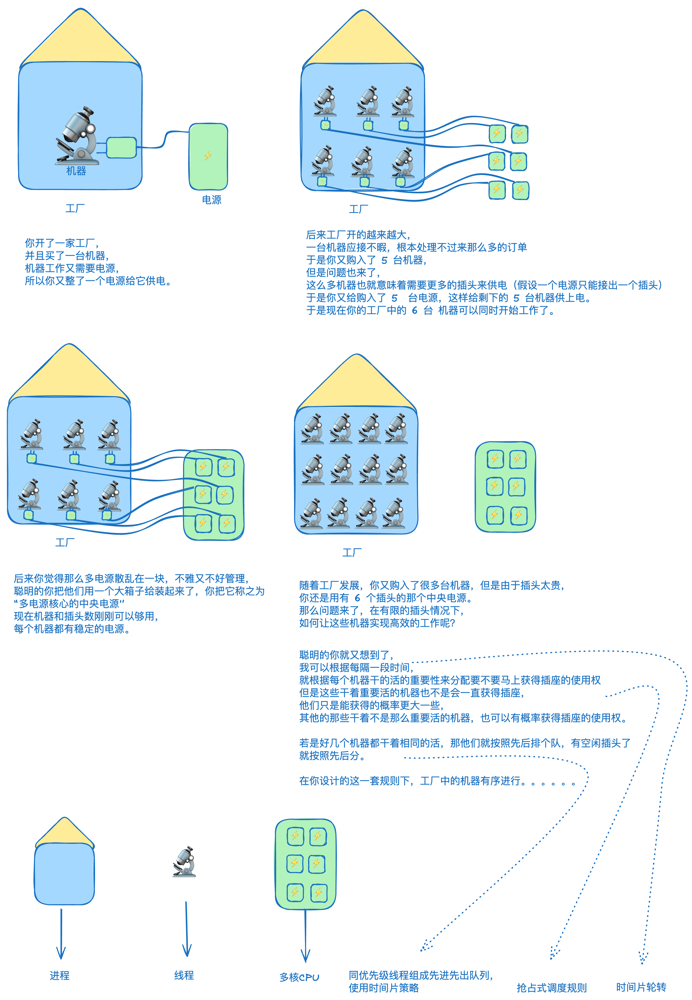
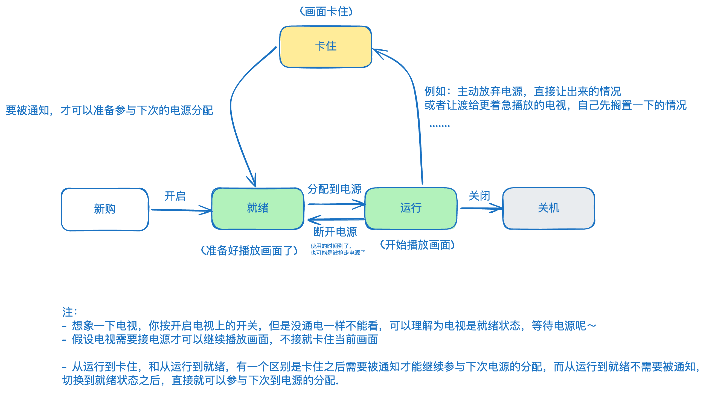
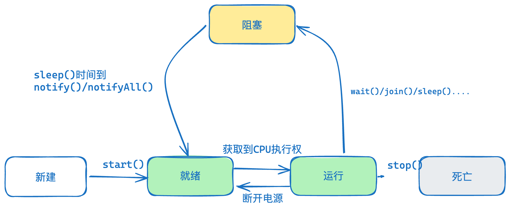
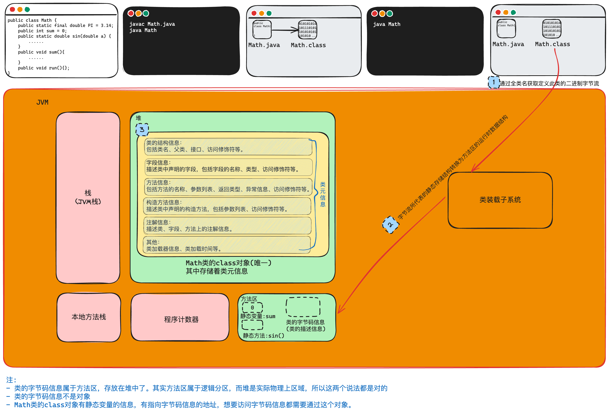
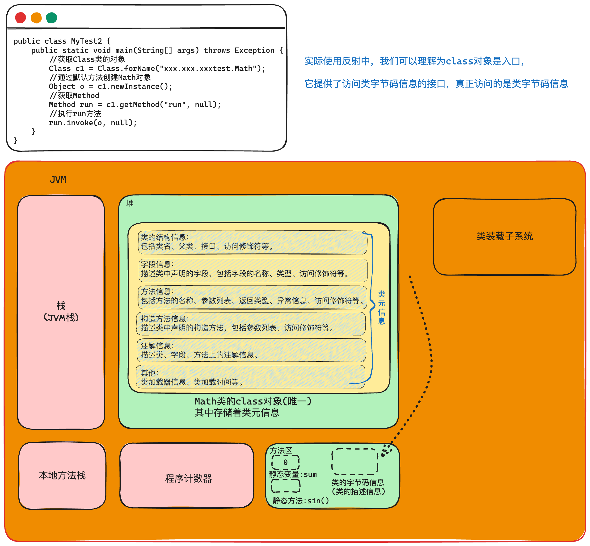

# IO
`I/O`技术用于处理设备之间的数据传输
>`IO流`是一组有序的，有起点和终点的数据集合，是对数据传输的总称和抽象。
<font color=#646a73>*更新时间：2024-01-31 17:23:52*</font>

`IO` 流的源和目的地：
- 内存
- 控制台
- 磁盘文件
- 网络端点

关于 `Input` 和 `Output`：
- `Input` 读取外部数据(磁盘、光盘等存储设备的数据)到程序(<font color="#de7802">内存</font>)中；
- `Output` 将程序(<font color="#de7802">内存</font>)数据输出到磁盘、光盘等存储设备中。
## IO 的分类
- 按照处理的数据单元不同：
	- 字节流：操作的数据单元是 `8` 位字节，`InputStream`、`OutputStream`。二进制文件(声音、图片、视频)、文本文件；
	- 字符流：操作的数据单元是 `16` 位字符，`Reader`、`Writer`，通常用于处理文本文件。
- 按照数据流流向不同：
	- 输入流：只能从中读取数据，而不能向其写入数据。`InputStream`、`Reader`；
	- 输出流：只能向其写入数据，而不能从中读取数据。`OutputStream`、`Writer`；

输入、输出都是从内存的角度进行划分，内存-->硬盘，输出流；硬盘-->内存，输入流。

| 流类型 | 字节流               | 字符流               |
|--------|----------------------|----------------------|
| 输入流 | `InputStream`        | `Reader`             |
| 输出流 | `OutputStream`       | `Writer`             |


Java 的 IO 流共涉及 40 多个类，实际上非常规则，都是从上面 4 个抽象基类派生的。

由这四个类派生出来的子类名称都是以其父类名作为子类名后缀。


`FileTest.java`
## FILE 类的基本操作
> `File` 类被定义为**文件和目录路径名的抽象表示形式**，这是因为 `File` 类既可以表示**文件**也可以表示**目录**，他们都通过对应的路径来描述。

`FileTest.java`
```java
package com.situ.iolearning;

import java.io.File;
import java.text.SimpleDateFormat;
import java.util.Date;

public class FileTest {
    public static void main(String[] args) {
        File file1 = new File("/Users/wangwenpeng/Code/JavaDeveloper/basic/HelloWorld.java");
        System.out.println(file1.isFile());
        System.out.println(file1.canRead());
        System.out.println(file1.canWrite());
        System.out.println(file1.length());
        System.out.println(file1.getAbsoluteFile());
        System.out.println(file1.getName());
        System.out.println(file1.isDirectory());
        System.out.println(file1.isFile());
        System.out.println(file1.isHidden());
        System.out.println(file1.lastModified());
        Date date = new Date(file1.lastModified());
        SimpleDateFormat sft = new SimpleDateFormat("yyyy年MM月dd日 HH:mm:ss");
        String str = sft.format(date);
        System.out.println(str);

        //File file2 = new File("/Users/wangwenpeng/Code/JavaDeveloper/basic/fileclasstest");
        //if (!file2.exists()) {
        //    file2.mkdir();
        //}

        //file2.delete();//删除文件夹

        //不可以列出下下一级文件夹中的内容。
        File file3 = new File("/Users/wangwenpeng/Code/JavaDeveloper/basic/山东");
        File[] files = file3.listFiles();
        //for (File file : files) {
        //    System.out.println(file);
        //}

        listAll("|--", file3);


    }

    //可以列出子文件夹中内容的方法
    public static  void listAll(String head, File file) {
        File[] files = file.listFiles();//列出第一层级的内容，返回一个文件类型的数组，这个数组中有的是文件夹，有的是文件
        for (File f : files) {//遍历数组
            System.out.println(head + f.getName());//打印
            if (f.isDirectory()) {//判断当前这个file类型的对象 f 是否是文件夹，如果是文件夹就再调用一次 自身。并且调用之前传一个 tab，这样这一次的调用打印时头部就是 tab + 文件名了
                listAll("\t" + head , f);
            }
        }
    }
}
```
## 字节流
>操作的数据单元是**8位字节**，主要涉及两个抽象类：`InputStream`、`OutputStream`。

`InputStreamTest.java`
```java
package com.situ.iolearning;

import java.io.FileInputStream;
import java.io.IOException;

public class InputStreamTest {
    public static void main(String[] args) throws IOException {
        FileInputStream in = new FileInputStream("/Users/wangwenpeng/Code/JavaDeveloper/basic/山东/666.txt");

        byte[] arr = new byte[16];

        //这个处理方式可能会最后一次读取的字节不够16，导致覆盖数组的时候会覆盖不全，所以最有一次打印有概率出现之前的字符串
        //while (in.read(arr) != -1) {
        //    //System.out.println(Arrays.toString(arr));
        //    String s = new String(arr);
        //    System.out.println(s);
        //}

        //处理方法：
        //第1种表达形式：：
        //int len = 0;
        //while ((len = in.read(arr,0,arr.length)) != -1) {
        //    String s = new String(arr, 0, len);
        //    System.out.println(s);
        //}

        //第2种表达形式：：
        int len = 0;
        while ((len = in.read(arr)) != -1) {
            String s = new String(arr, 0, len);
            System.out.println(s);
        }

        in.close();

    }
}
```
`OutputStreamTest.java`
```java
package com.situ.iolearning;  
  
import java.io.FileOutputStream;  
import java.io.IOException;  
  
public class OutputStreamTest {  
    public static void main(String[] args) throws IOException {  
        FileOutputStream out = new FileOutputStream("/Users/wangwenpeng/Code/JavaDeveloper/basic/山东/out.txt");  
        String str = "helloJava";  
  
        byte[] arr = str.getBytes();    //String --> byte[] 要先换成 byte  
  
        out.write(arr,0,arr.length);    //把数组 arr 中的，从 0开始，数组有多长就写入多长  
        out.close();    //关闭流  
    }  
}
```
`CopyFile.java`
通过输入流输出流实现复制文件功能
```java
package com.situ.iolearning;  
  
import java.io.FileInputStream;  
import java.io.FileOutputStream;  
import java.io.IOException;  
  
public class CopyFile {  
    public static void main(String[] args) throws IOException {  
        FileInputStream in = new FileInputStream("/Users/wangwenpeng/Code/JavaDeveloper/basic/山东/google.txt");  
        FileOutputStream out = new FileOutputStream("/Users/wangwenpeng/Code/JavaDeveloper/basic/山东/google_new.txt");  
  
        int len = 0;  
        byte[] arr = new byte[128]; //用于存储的缓冲数组  
        while ((len = in.read(arr)) != -1) {    //只要没读到末尾就读  
            out.write(arr,0,len);   //把arr数组，从0 开始，把 len 个长度写入  
        }  
  
        //先打开的后关闭  
        out.close();  
        in.close();  
  
    }  
}
```
## 字符流
> 操作的数据单元是**16位字符**，主要涉及两个抽象类：`Reader`、`Writer`，通常用于处理文本文件。

`InputReaderTest.java`
```java
package com.situ.iolearning;  
  
import java.io.FileReader;  
  
public class InputReaderTest {  
    public static void main(String[] args) throws Exception {  
        //创建流  
        FileReader in = new FileReader("/Users/wangwenpeng/Code/JavaDeveloper/basic/山东/google.txt");  
  
        //使用流  
  
        int len; //用于存储每次读取之后返回的长度  
        char[] arr = new char[128]; //创建一个用于暂存的数组  
  
        //read() 方法的返回值是这次读取的长度，如果读到末尾，则返回 -1        
        //从输入流中每次读取128个字符，放入到数组中，并且返回每次读取的长度(注意，最后一次读取的长度可能不是128)  
  
        while ((len = in.read(arr)) != -1) {    //  首先用 len 把这次读取的长度存储，并且判断是否到文件尾  
            //刚刚读了多少的东西，就把多少的东西从数组的0号位置开始取出来放到字符串中  
            String str = new String(arr,0,len); //字符数组 -> 字符串  
            System.out.print(str);  
        }  
        //关闭流  
        in.close();  
    }  
}
```
`FileWriter.java`
```java
package com.situ.iolearning;  
  
import java.io.FileWriter;  
  
public class OutputWriteTest {  
    public static void main(String[] args) throws Exception {  
        //创建流  
        FileWriter out = new FileWriter("/Users/wangwenpeng/Code/JavaDeveloper/basic/山东/out2.txt");  
  
  
        //使用流  
        String str = "what the fork say?";  
        out.write(str);  
  
        //还有一种使用先把字符串转换成字符数组的方式  
        //char[] arr = new char[128];  
        //out.write(arr,0,arr.length);  
  
        //关闭流  
        out.close();  
    }  
}
```
`CopyFile_CharStream.java`
实现复制文件功能
```java
package com.situ.iolearning;  
  
import java.io.FileReader;  
import java.io.FileWriter;  
  
public class CopyFile_CharStream {  
    public static void main(String[] args) throws Exception {  
        //创建流  
        FileReader in = new FileReader("/Users/wangwenpeng/Code/JavaDeveloper/basic/山东/google.txt");  
        FileWriter out = new FileWriter("/Users/wangwenpeng/Code/JavaDeveloper/basic/山东/google_new2.txt");  
  
        //使用流  
        int len;  
        char[] arr = new char[128];  
        while ((len = in.read(arr)) != -1) {  
            out.write(arr,0,len); //刚刚读了多少长度(len)的的东西，就从数组的 0 号位置拿出多少东西写  
        }  
        //关闭流  
        in.close();  
        out.close();  
    }  
}
```

## 缓冲流
>为了提高数据读写的速度，Java API 提供了带缓冲功能的流类，在使用这些流类时，会创建一个内部缓冲区数组，默认使用**8192**个字节或字符的缓冲区。缓冲流要**套接**在相应的节点流之上。

| 分类 |  |
| ---- | ---- |
| `BufferedInputStream` | `BufferedOutputStream` |
| `BufferedReader` | `BufferedWriter` |

当使用 `BufferedInputStream` 读取字节文件时，`BufferedInputStream` 会一次性从文件中读取 `8192个(8Kb)`，存在缓冲区中，直到缓冲区装满了，才重新从文件中读取下一个8192个字节数组。


向流中写入字节时，不会直接写到文件，先写到缓冲区中直到缓冲区写满，`BufferedOutputStream` 才会把缓冲区中的数据一次性写到文件里。使用方法 `flush()` 可以强制将缓冲区的内容全部写入输出流。

**关闭流的顺序和打开流的顺序相反**。**只要关闭最外层流即可**，关闭最外层流也会相应关闭内层节点流。

### 使用缓冲流实现文件拷贝
`CopyFile_CacheStream.java`
```java
package com.situ.iolearning;  
  
import java.io.*;  
  
public class CopyFile_CacheStream {  
    public static void main(String[] args) throws Exception {  
        BufferedReader in = new BufferedReader(new FileReader("/Users/wangwenpeng/Code/JavaDeveloper/basic/山东/google.txt"));  
        BufferedWriter out = new BufferedWriter(new FileWriter("/Users/wangwenpeng/Code/JavaDeveloper/basic/山东/google_new3.txt"));  
  
        int len;  
        char[] arr = new char[128];  
        while ((len = in.read(arr)) != -1){  
            out.write(arr,0,len);  
        }  
  
        in.close();  
        out.close();  
    }  
}
```

### 按行读取
`ReadLineTest.java`
```java
package com.situ.iolearning;  
  
import java.io.BufferedReader;  
import java.io.FileReader;  
  
public class ReadLineTest {  
    public static void main(String[] args) throws Exception {  
        BufferedReader in = new BufferedReader(new FileReader("/Users/wangwenpeng/Code/JavaDeveloper/basic/山东/readbyline.txt"));  
  
        int len;  
        String line = null;  
        while ((line = in.readLine()) != null) {  
            System.out.println(line);  
        }  
  
        in.close();  
    }  
}
```


# 多线程

## 基本概念
- 程序
	- 是为完成特定任务、用某种语言编写的一组<font color="#de7802">指令的集合</font>。即指一段<font color="#de7802">静态</font>的代码，静态对象。
- 进程
	- 程序的一次执行过程，或是正在运行的一个程序。
	- 进程是动态的,进程作为资源分配的单位，系统在运行时会为每个进程分配不同的内存区域。
- 线程
	- 线程时进程的最小执行单位，是 CPU 的最小调度单位
	- 进程的进一步细化
	- 若一个进程同一时间并行执行多个线程，那它就是支持多线程的
	- 线程的切换开销更小
	- 一个进程中的多个线程<font color="#de7802">共享</font>相同的内存单元/内存地址空间，它们从同一堆中分配对象，可以访问相同的变量和对象。但是这也会带来访问的一些问题
	- 每个 Java 程序都有一个隐含的主线程：`main` 方法。

## 线程的调度和生命周期
调度策略:

- 基于时间片轮转；
- 抢占式：高优先级的线程抢占 CPU。

调度方法：
- 同优先级线程组成先进先出队列，使用时间片策略
- 对高优先级，使用优先调度的抢占式策略
- Java中线程优先级的范围是1~10，默认的优先级是5
    - `MAX_PRIORITY(10)`
    - `MIN_PRIORITY(1)`
    - `NORM_PRIORITY(5)`

涉及到的方法：
- `setPriority(int newPriority)`：设置线程的优先级
- `getPriority()`：获取线程的优先级
- `yield()`：线程让步
    - 暂停当前正在执行的线程，把执行机会让给优先级相同或更高的线程
    - 若队列中没有同优先级的线程，忽略此方法
- `join()`：
    - 当某个程序执行流中调用其他线程的`join()`方法时，**调用线程将被阻塞**，直到`join()`方法加入的`join`线程执行完为止
    - 低优先级的线程也可以获得执行
- `sleep(long millis)`：令当前活动线程在指定时间段内放弃对CPU控制,使其他线程有机会被执行,时间到后重排队
- `stop()`：强制线程生命期结束
- `isAlive()`：判断线程是否还活着



- **新建**： 当一个 `Thread` 类或其子类的对象被声明并创建时，新生的线程对象处于新建状态；
- **就绪**：处于新建状态的线程被 `start()` 后，将进入线程队列**等待 CPU 时间片**，此时它已具备了运行的条件；
- **运行**：当就绪的线程被调度并获得处理器资源时，便进入运行状态， `run()` 方法定义了线程的操作和功能；
- **阻塞**：在某种特殊情况下，被人为挂起或执行输入输出操作时，让出 CPU 并临时中止自己的执行，进入阻塞状态；
- **死亡**：线程完成了它的全部工作或线程被提前强制性地中止。



## 线程的创建和使用
>在同一时间需要处理多个任务时就可以使用多线程。
### 继承 Thread 类
>继承 `Thread` 类，重写 `run` 方法

- 编写继承 `Thread ` 类，重写 `run()` 方法的 <font color="#de7802">Thread 子类</font>
- 根据此 <font color="#de7802">Thread 子类</font> 创建线程对象
- 调用线程对象 `start` 方法

`EatThread.java`
```java
package com.situ.threadlearning.basic;  
  //吃饭线程的定义
public class EatThread extends Thread{  
    @Override  
    public void run() {  
        for (int i = 0; i < 100; i++) {  
            System.out.println("吃饭");  
            //现代处理器运行速度太快了，处理简单的for直接完成了，不睡眠一下都来不及且换下个线程  
            try {  
                Thread.currentThread().sleep(100);  
            } catch (InterruptedException e) {  
                throw new RuntimeException(e);  
            }  
        }  
    }  
}
```
`DrinkThread.java`
```java
package com.situ.threadlearning.basic;  
  //喝酒线程的定义
public class DrinkThread extends Thread{  
    public void run() {  
        for (int i = 0; i < 100; i++) {  
            System.out.println("喝酒");  
            //现代处理器运行速度太快了，处理简单的for直接完成了，不睡眠一下都来不及且换下个线程  
            try {  
                Thread.currentThread().sleep(100);  
            } catch (InterruptedException e) {  
                throw new RuntimeException(e);  
            }  
        }  
    }  
}
```
`ChatThread.java`
```java
package com.situ.threadlearning.basic;  
//吃饭线程的定义
public class ChatThread extends Thread{  
    public void run() {  
        for (int i = 0; i < 100; i++) {  
            System.out.println("聊天");  
            //现代处理器运行速度太快了，处理简单的for直接完成了，不睡眠一下都来不及且换下个线程  
            try {  
                Thread.currentThread().sleep(100);  
            } catch (InterruptedException e) {  
                throw new RuntimeException(e);  
            }  
        }  
    }  
}
```
`Test.java`
```java
package com.situ.threadlearning.basic1;  
  
public class Test {  
    public static void main(String[] args) {  
        //分别创建了三个线程的对象  
        ChatThread chat = new ChatThread();  
        DrinkThread drink = new DrinkThread();  
        EatThread eat = new EatThread();  
        //启动这三个线程  
        chat.start();  
        drink.start();  
        eat.start();  
    }  
}
```

```shell
结果是在控制台中没有规律的打印 吃饭 喝酒 聊天

在 main 这个主线程按顺序运行完三个 start() 之后，就启动这三个子线程，这三个线程就有获得CPU时间片的资格了，待他们获得时间片后就会运行自己的 run方法体 中的东西。
实际上的情况是这三个字线程同时在运行，如果控制台支持的话，打印的情况应该是这样的：
｜----------------------------｜--------------------------｜---------------------------------｜
｜聊天                          吃饭                         喝酒
｜聊天                          吃饭                         喝酒
｜聊天                          吃饭                         喝酒
｜聊天                          吃饭                         喝酒
｜聊天                          吃饭                         喝酒
｜聊天                          吃饭                         喝酒

但是实际上在控制台中同时只能被 一个线程占用，所以还是按着顺序来的。
```

`chat`、`drink`、`eat` 是三个独立的对象。这三个线程对象之间没有共享的公共数据（实例变量），它们是相互独立的。

#### Thread 的相关方法
相关方法：
- `start()`：启动线程，并执行对象的`run()`方法；
- `run()`：线程在被调用时执行的操作；
- `getName()`：返回线程的名称；
- `setName()`：设置线程的名称；
- `currentThread()`：返回当前线程。

`ThreadClass.java`
```java
package com.situ.threadlearning.basic3;  
  
public class ThreadClass extends Thread{  
    public void run() {  
        for (int i = 0; i < 10; i++) {  
            System.out.println(Thread.currentThread().getName() + "\t第" + i + "次");  
            try {  
                Thread.currentThread().sleep(100);  
            } catch (InterruptedException e) {  
                throw new RuntimeException(e);  
            }  
        }  
    }  
}
```
`ThreadClass2.java`
```java
package com.situ.threadlearning.basic3;

public class ThreadClass2 extends Thread{
    private Thread thread;
    public ThreadClass2() {
    }

    public ThreadClass2(Thread thread) {
        this.thread = thread;
    }

    public void run() {
        for (int i = 0; i < 10; i++) {
            System.out.println(Thread.currentThread().getName() + "\t第" + i + "次");


            /*
             * 当运行到 第 5 次时，当前线程(thread222)会执行thread111.join()方法，
             * 这会阻塞 thread111.join() 的调用线程(thread222)，
             * thread222 线程阻塞，然后转而去把 thread111线程 进行完，然后再执行线程 thread222
             *
             * */
            try {
                if (i == 4) {
                    thread.join();
                }
                Thread.currentThread().sleep(3);
            }catch (InterruptedException e) {
                throw new RuntimeException();
            }
        }
    }
}
```
`ThreadClassTest.java`
```java
package com.situ.threadlearning.basic3;  
  
public class ThreadClassTest {  
    public static void main(String[] args) throws Exception {  
        Thread.currentThread().setName("主线程");  
  
        ThreadClass thread111 = new ThreadClass();//创建线程对象 thread111        
        thread111.setName("thread111线程");//给thread111线程设置名字  
  
        /*  
        * 创建线程对象 thread222，创建时传入了线程对象 thread111的引用(地址)  
        * 这意味着 在thread222中，有了找到 thread111的 能力  
        * */        
        ThreadClass2 thread222 = new ThreadClass2(thread111);  
        thread222.setName("thread222线程");//给thread222设置名字  
  
        thread111.start();//启动thread111线程  
        thread222.start();//启动thread222线程  
  
    }  
}
```

### 实现 Runnable 接口
>实现 `Runnable` 接口，重写 `run()`

- 编写实现 `Runnable` 接口，重写 `run` 方法的实现类
- 根据此实现类创建<u>接口实现类对象</u>
- 将<u>接口实现类的对象</u>作为实际参数传递给 `Thread` 类的构造方法中，创建出线程对象
- 调用线程对象的 `start` 方法：开启线程

优点：
- 避免了单继承的局限性；
- 多个线程可以共享同一个接口实现类的对象，**非常适合多个相同线程来处理同一份资源**。

`Eat.java`
```java
package com.situ.threadlearning.basic2;  
  
public class Eat implements Runnable{  
    @Override  
    public void run() {  
        for (int i = 0; i < 100; i++) {  
            System.out.println("吃饭");  
            //现代处理器运行速度太快了，处理简单的for直接完成了，不睡眠一下都来不及且换下个线程  
            try {  
                Thread.currentThread().sleep(100);  
            } catch (InterruptedException e) {  
                throw new RuntimeException(e);  
            }  
        }  
    }  
}

```
```java
package com.situ.threadlearning.basic2;  
  
public class Chat implements Runnable{  
    @Override  
    public void run() {  
        for (int i = 0; i < 100; i++) {  
            System.out.println("聊天");  
            //现代处理器运行速度太快了，处理简单的for直接完成了，不睡眠一下都来不及且换下个线程  
            try {  
                Thread.currentThread().sleep(100);  
            } catch (InterruptedException e) {  
                throw new RuntimeException(e);  
            }  
        }  
    }  
}
```
`Drink.java`
```java
package com.situ.threadlearning.basic2;  
  
public class Drink implements Runnable{  
    @Override  
    public void run() {  
        for (int i = 0; i < 100; i++) {  
            System.out.println("喝酒");  
            //现代处理器运行速度太快了，处理简单的for直接完成了，不睡眠一下都来不及且换下个线程  
            try {  
                Thread.currentThread().sleep(100);  
            } catch (InterruptedException e) {  
                throw new RuntimeException(e);  
            }  
        }  
    }  
}
```
`Test.java`
```java
package com.situ.threadlearning.basic2;  
  
public class Test {  
    public static void main(String[] args) {  
        //创建 Runnable 接口实现类的对象  
        Eat eat = new Eat();  
        Drink drink = new Drink();  
        Chat chat = new Chat();  
        //使用传入Runnable接口实现类对象的方式 创建线程对象  
        Thread t1 = new Thread(eat);  
        Thread t2 = new Thread(drink);  
        Thread t3 = new Thread(chat);  
        Thread t4 = new Thread(new Runnable() {//使用匿名内部类创建一个实现 Runnable接口重写run的接口实现类  
            @Override  
            public void run() {  
                for (int i = 0; i < 5; i++) {  
                    System.out.println(Thread.currentThread().getName() + "\t唱歌");  
                    //现代处理器运行速度太快了，处理简单的for直接完成了，不睡眠一下都来不及且换下个线程  
                    try {  
                        Thread.currentThread().sleep(100);  
                    } catch (InterruptedException e) {  
                        throw new RuntimeException(e);  
                    }  
                }  
            }  
        });  
          
        t1.start();  
        t2.start();  
        t3.start();  
        t4.start();  
        System.out.println(Thread.currentThread().getName());  
  
    }  
}
```

```shell
main
Thread-0	吃饭
Thread-2	聊天
Thread-3	唱歌
Thread-1	喝酒
Thread-0	吃饭
Thread-2	聊天
Thread-1	喝酒
Thread-3	唱歌
Thread-2	聊天
Thread-0	吃饭
Thread-1	喝酒
Thread-3	唱歌
Thread-2	聊天
Thread-0	吃饭
Thread-1	喝酒
Thread-3	唱歌
Thread-3	唱歌
Thread-2	聊天
Thread-0	吃饭
Thread-1	喝酒

进程已结束，退出代码为 0

```
`main` 方法运行在主线程中，而主线程与其他线程是并发执行的。
"main"并不是一定会出现在第一行，多试几次就发现了。

这个例子并没有体现出使用 runnable 接口创建线程时，多个线程处理同一份资源的优势，在后续的 [synchronized 代码块](#synchronized%20代码块) 我们可以看到使用 Runnable 接口和 Thread 类创建多线程卖票小程序的不同实现。

### 实现 Callable 接口
>JDK 5.0 新增创建方式

- 相比 `run()` 方法，可以有返回值；
- 方法可以抛出异常；
- 支持泛型的返回值；
- 需要借助 `FutureTask` 类，比如获取返回结果。

`SumNum.java`
```java
package com.situ.threadlearning.basic4;  
  
import java.util.concurrent.Callable;  
  
  
  
/*  
* 定义实现 Callable接口，重写 call()方法的线程定义类  
* 使用类泛型接口，泛型参数会影响这个接口中的返回值  
* 我们要定义的是求和的方法，泛型参数中写 Integer*  
* public interface Callable<V> {  
*  
*    V call() throws Exception;  
* }  
*  
* 方法中我们使用的是 int 类型，其实在返回的时候还包含  
* 一个自动装箱的操作。  
* */  
public class SumNum implements Callable<Integer> {  
    @Override  
    public Integer call() throws Exception {  
        int sum = 0;  
        for (int i = 0; i < 101; i++) {  
            sum = sum + i;  
        }  
        return sum;  
    }  
}
```
`CallableTest.java`
```java
package com.situ.threadlearning.basic4;  
  
import java.util.concurrent.ExecutionException;  
import java.util.concurrent.FutureTask;  
  
public class CallableTest {  
    public static void main(String[] args) {  
        SumNum sumNum = new SumNum();  
        FutureTask<Integer> task = new FutureTask<>(sumNum);  
        Thread thread = new Thread(task);//创建线程对象  
        thread.start();//启动线程对象  
  
        try {  
            Integer sum = task.get();//借助task类对象获取返回结果  
            System.out.println(sum);  
        } catch (InterruptedException e) {  
            throw new RuntimeException(e);  
        } catch (ExecutionException e) {  
            throw new RuntimeException(e);  
        }  
    }  
}
```

### 使用线程池
>线程池中有多个已经提前创建好的线程，使用时直接获取，用完放回，避免频繁创建销毁线程带来的性能影响。

`SumNum.java`
```java
package com.situ.threadlearning.basic5;  
  
public class SumNum implements Runnable {  
    @Override  
    public void run() {  
        int sum = 0;  
        for (int i = 0; i < 101; i++) {  
            if (i % 2 == 0) {  
                System.out.println(Thread.currentThread().getName() + ":" + i);  
            }  
        }  
    }  
}
```
`SumNum2.java`
```java
package com.situ.threadlearning.basic5;  
  
public class SumNum2 implements Runnable {  
    @Override  
    public void run() {  
        int sum = 0;  
        for (int i = 0; i < 101; i++) {  
            if (i % 2 == 0) {  
                System.out.println(Thread.currentThread().getName() + ":" + i);  
            }  
        }  
    }  
}
```
`Test.java`
```java
package com.situ.threadlearning.basic5;  
  
import java.util.concurrent.ExecutorService;  
import java.util.concurrent.Executors;  
  
public class Test {  
    public static void main(String[] args) {  
        //创建有10个线程的可以重复利用的线程池  
        ExecutorService service = Executors.newFixedThreadPool(10);  
        //创建了两个线程对象  
        SumNum SumNum = new SumNum();  
        SumNum2 SumNum2 = new SumNum2();  
  
        //执行这两个线程对象  
        service.execute(SumNum);  
        service.execute(SumNum2);  
        //关闭线程  
        service.shutdown();  
    }  
}
```


## 线程同步
<font color=#646a73>*更新时间：2024-02-01 22:06:16*</font>
希望哪段代码被一个线程执行完才允许其他线程执行，就使用 `synchronized` 代码块将代码圈起来
()中要填写唯一的对象，“钥匙”，这个对象必须是唯一的
* 字节码文件 --- 唯一的
* 类名-class --- 唯一的


### synchronized 代码块
```java
package com.situ.threadlearning.threadsync.sellticket_runnable;  
  
public class Window implements Runnable{  
    private int count = 100; //100张票  
  
    @Override  
    public void run() {  
        while (true) {  
            //使用 syncchronized代码块使得代码块中的内容是作为一个整体运行的  
            //一旦运行到这个块，就不允许其他的线程对这个块操作  
            synchronized (this) {  
                if (count > 0) {  
                    System.out.println(Thread.currentThread().getName() + "第" + count + "张票");  
                    count--;  
                }else {  
                    break;  
                }  
            }  
  
            try {  
                Thread.sleep(3);  
            } catch (InterruptedException e) {  
                throw new RuntimeException(e);  
            }  
  
        }  
    }  
}
```

```java
package com.situ.threadlearning.threadsync.sellticket_runnable;  
  
public class Test {  
    public static void main(String[] args) {  
        Window window = new Window();  
        Thread window1 = new Thread(window);  
        Thread window2 = new Thread(window);  
        Thread window3 = new Thread(window);  
  
        window1.setName("窗口1");  
        window2.setName("窗口2");  
        window3.setName("窗口3");  
  
        window1.start();  
        window2.start();  
        window3.start();  
    }  
}
```

理解：通过 `Thread` 创建了三个线程对象，此时堆内存空间中有四个对象，window 和三个线程对象 `window1 ` `window2 ` `window3`。但是注意，这三个线程在创建时都传入了一个对象，这意味着这三个线程共享一个对象实例。可以理解为这三个对象都是对这个引用指向的空间进行操作。这个 `window` 实例只有一份 `count`，这样就实现了三个线程对 `count` 对操作和共享。


```java
package com.situ.threadlearning.threadsync.sellticket_thread;  
  
public class Window1 extends Thread{  
    private static int count = 100; //100张票  
  
    @Override  
    public void run() {  
        while (true) {  
            synchronized (Object.class) {  
                if (count > 0) {  
                    System.out.println(Thread.currentThread().getName() + "第" + count + "张票");  
                    count--;  
                }else {  
                    break;  
                }  
            }  
  
            try {  
                Thread.sleep(3);  
            } catch (InterruptedException e) {  
                throw new RuntimeException(e);  
            }  
  
        }  
    }  
}
```

```java
package com.situ.threadlearning.threadsync.sellticket_thread;  
  
public class Test {  
    public static void main(String[] args) {  
        //创建了三个线程  
        Window1 window1 = new Window1();  
        Window1 window2 = new Window1();  
        Window1 window3 = new Window1();  
        //设置线程名  
        window1.setName("窗口1");  
        window2.setName("窗口2");  
        window3.setName("窗口3");  
        //启动  
        window1.start();  
        window2.start();  
        window3.start();  
    }  
}
```

通过 `Window1 windowx = new Window1();` 这样的语句为每个线程分别创建了一个 `Window1` 对象实例，这些实例在堆内存中独立存在。每个线程对象都有自己的线程栈，用于执行 `run` 方法。因此，创建的三个线程对象分别占据堆内存中的不同位置。所以每个线程在 `run` 方法中执行到 `synchorized` 代码块时，这个 `this` 所指代的都是当前对象，哪个线程运行到这，这个 `this` 就指代谁，这样的话三个线程三个 this `不同`，无法实现锁的效果。

如果使用的是唯一锁，例如 `Object.class`，同时又是对内存中同一块的 `run` 方法区操作的时候，就可以锁了。

### synchronized 方法
```java
//所有窗口共用100张票
public class Window2 implements Runnable {
	private int count = 100;
	@Override
	public void run() {
		while(true) {
			sale();
			if(count <= 0) {
				break;
			}
			try {
				Thread.currentThread().sleep(100);
			} catch (InterruptedException e) {
				// TODO Auto-generated catch block
				e.printStackTrace();
			}
		}
	}
	
	//同步方法  该方法运行完毕之后，其他的线程才会运行
	public synchronized void sale() {
		if(count > 0) {
			System.out.println(Thread.currentThread().getName() + "卖第" + (count--) + "张票");
		}
	}
}
```

`Thread` 和 `Runnable`
-  `Thead` 每次都是创建新的线程对象
- 通过一个 `Runnable` 实现类来创建线程，他们共享这个 `Runnable` 实现类的空间。


### Lock 锁
```java
package com.situ.threadlearning.threadsync.locklocker;  
  
import java.util.concurrent.locks.ReentrantLock;  
  
//线程任务的定义类  
public class LockLocker implements Runnable{  
    private int count = 100;  
  
    //使用给定的公平策略创建ReentrantLock的实例  
    private ReentrantLock lock = new ReentrantLock(true);  
  
    @Override  
    public void run() {  
        while (true) {  
            try {  
                //被锁框起来的这段代码每次只能有一个线程对资源进行访问  
                lock.lock();//运行这段代码时要先加锁  
                if (count > 0) {  
                    System.out.println(Thread.currentThread().getName() + "第" + count + "次");  
                    count--;  
                }else {  
                    break;  
                }  
                Thread.sleep(3);//睡眠一下，防止运行速度过快看不清  
            } catch (InterruptedException e) {  
                throw new RuntimeException(e);  
            }finally {  
                lock.unlock();//无论如何，finally中的内容都会运行，肯定会释放锁  
            }  
        }  
    }  
}
```
```java
package com.situ.threadlearning.threadsync.locklocker;  
  
public class Test {  
    public static void main(String[] args) {  
        LockLocker locker = new LockLocker();//线程任务定义类的对象  
        //根据线程任务对象创建3个线程  
        Thread t1 = new Thread(locker);  
        Thread t2 = new Thread(locker);  
        Thread t3 = new Thread(locker);  
  
        Thread.currentThread().setName("主线程");  
        t1.setName("t1:");  
        t2.setName("t2:");  
        t3.setName("t3:");  
  
        t1.start();  
        t2.start();  
        t3.start();  
    }  
}
```

使用线程同步实现线程安全的单例模式
>懒汉式

```java
package com.situ.threadlearning.threadsync.singleobject;  
  
public class SingleObject {  
    private static SingleObject obj = null;//创建一个静态的，类型为 SingleObject类型的引用  
  
    private SingleObject() {  
  
    }  
      
    //使用synchronized方法，实现线程在调用这个方法的时候，排他性。  
    //要不然就可能出现 当线程1运行就要运行到 new的时候，结果线程切换到线程2，  
    //线程2一看现在 obj还是null，直接new出来一个对象，  
    //时间片回到线程1，然后它又new一下。  
    public static synchronized SingleObject getInstance() {  
        //如果obj是空的话，就可以创建对象(创建一次对象之后obj肯定不会空)  
        if (SingleObject.obj == null) {  
            obj = new SingleObject();  
        }  
        return obj;//把创建号的对象返回出去  
    }  
}
```

因为默认构造方法是 `private` 的，直接 `new` 对象 `new` 不出来，想要调用只能 `static`

## 线程死锁
```java
public class Lock {  
    static Object objA = new  Object();  
    static Object objB = new  Object();  
}
```
```java
package com.situ.threadlearning.threadsync.deadlocker;  
  
public class AThread extends Thread{  
    public void run() {  
        while (true) {  
            synchronized (Lock.objA) {  
                synchronized (Lock.objB) {  
                    System.out.println("Athread.......");  
                }  
            }  
        }  
    }  
}
```
```java
package com.situ.threadlearning.threadsync.deadlocker;  
  
public class BThread extends Thread{  
    public void run() {  
        while (true) {  
            synchronized (Lock.objB) {  
                synchronized (Lock.objA) {  
                    System.out.println("Bthread.......");  
                }  
            }  
        }  
    }  
}
```
```java
package com.situ.threadlearning.threadsync.deadlocker;  
  
public class Test {  
    public static void main(String[] args) {  
        AThread a = new AThread();  
        BThread b = new BThread();  
        a.start();  
        b.start();  
    }  
}
```
```shell
打印几行之后就会卡死
```

当这两个线程都在第一个 `synchronized` 的时候，他们分别有了 `Lock.objA` 钥匙和 `Lock.objB` 钥匙，但是下一步他们都开始期待着对放释放自己的钥匙，结果最后就是谁都没让谁...就僵持在那里。

## 线程通信
`PrintNum.java`
```java
package com.situ.threadlearning.threadcommunication;  
  
  
//用于定义这个线程的任务："打印数字"  
public class PrintNum implements Runnable{  
    private int num = 1;  
  
    @Override  
    public void run() {  
        while (true) {  
              
            /**  
             * 使用synchronized代码块，使得代码块中的内容成为一个整体，  
             * 当一个线程运行到这里的时候，其他线程不容侵犯！  
             *   
             * Object的字节码文件是唯一的.可以用来当唯一的"钥匙"  
             */            synchronized (Object.class) {  
                  
                //通知其他线程进入唤醒状态(通知他们可以等着我用完CPU之后来抢)  
                Object.class.notify();        
                  
                //打印数组的操作  
                if (num <= 100) {  
                    System.out.println(Thread.currentThread().getName() + "第" + num + "次");  
                    num++;  
                }else {  
                    break;  
                }  
  
                /*  
                * 正常打印完成之后要到这里来调用 wait()，  
                * 使之当前进程挂起并放弃CPU，  
                * 等待其他线程使用notify方法唤醒  
                * */                try {  
                    //打印完一次数字之后让当前进程进去等待状态，释放了公共资源和Object.clas  
                    Object.class.wait();  
                } catch (InterruptedException e) {  
                    throw new RuntimeException(e);  
                }  
  
            }  
        }  
    }  
}
```
`PrintNumTest.java`
```java
package com.situ.threadlearning.threadcommunication;  
  
public class PrintNumTest {  
        public static void main(String[] args) {  
                //创建线程任务对象  
                PrintNum printNum= new PrintNum ();  
                //根据线程任务对象创建两个线程  
                Thread t1= new Thread (printNum);  
                Thread t2= new Thread (printNum);  
                //分别给这两个线程设置线程的名字  
                t1.setName("线程1");  
                t2.setName("线程2");  
                //分别启动两个线程  
                t1.start();  
                t2.start();  
        }  
}
```


# 网络编程
>用 Java 语言实现计算机间数据的信息传递和资源共享；

## 网络参考模型
### OSI 参考模型
>理论上的标准

| 应用层 |
| ---- |
| 表示层 |
| 会话层 |
| 传输层 |
| 网络层 |
| 数据链路层 |
| 物理层 |

### TCP/TP 协议族
>事实上的标准

| 应用层 |
| ---- |
| 传输层 |
| 网络层 |
| 数据链路层 |

## 网络套接字
>套接字可以简单理解为"IP:Port"，网络上具有唯一标识的套接字是网络通信中的唯一标识符。

## 基于 TCP 协议的网络编程
`Server.java`
```java
package com.situ.netcoding.socket1;  
  
import java.io.InputStream;  
import java.net.InetAddress;  
import java.net.ServerSocket;  
import java.net.Socket;  
  
public class Server {  
    public static void main(String[] args) throws Exception {  
        //创建监听套接字，监听本地的60000端口  
        ServerSocket serverSocket = new ServerSocket(60000);  
  
        System.out.println("服务器已上线...");  
  
        while (true) {  
            //获取已连接的套接字---调用 accept的程序会一只卡在这里，直到有连接才返回  
            Socket socket = serverSocket.accept();  
  
            //获取连接上套接字的主机的地址  
            InetAddress inetAddress = socket.getInetAddress();//Returns the address to which the socket is connected.  
            String ip = inetAddress.getHostAddress();//返回IP地址的字符串形式  
  
            //获取连接上套接字的主机的端口号  
            int port = socket.getPort();  
            System.out.println(ip + ":" + port + "已连接");  
  
            int len = 0;  
            byte[] arr = new byte[128];//用于做输入流的一个缓冲暂存数组  
            InputStream in = socket.getInputStream();//从套接字中获取输入流  
  
            //只要没有读到末尾，就一直打印  
            while ((len = in.read(arr)) != -1) {//把流中的内容读带arr中，并且返回本次读到的长度  
                String str = new String(arr,0,len);//读到多少个就把多少个转换成字符串，  
                System.out.println(str);//并且打印  
            }  
  
            //关闭套接字  
            socket.close();  
        }  
    }  
}
```
`Client.java`
```java
package com.situ.netcoding.socket1;  
  
import java.io.OutputStream;  
import java.net.Socket;  
import java.util.Scanner;  
  
public class Client {  
    public static void main(String[] args) throws Exception {  
        //创建套接字，只要和服务器连接成功，就会返回  
        Socket socket = new Socket("127.0.0.1", 60000);  
  
        byte[] arr = null;  
        //获取IO流  
        //创建了一个输出流，客户端是处理完用户输入后，从客户端输出的  
        OutputStream out = socket.getOutputStream();  
  
        while (true) {  
            //获取用户输入  
            Scanner scanner = new Scanner(System.in);  
            String str = scanner.next();  
            //如果输入的是 exit，则直接 跳出了循环  
            if (str.equals("exit")) {  
                break;//跳出while循环  
            }  
  
            //把用户输入的内容转化成字节，然后把这些内容写到输出流中  
            //如果是 break跳出了while循环，本次就没有向输出流中写入任何数据，服务器那边就可以读到文件末尾返回-1了  
            out.write(str.getBytes());  
        }  
  
        //关闭套接字  
        socket.close();  
    }  
}
```
---
`ServerThread_Version.java`
```java
package com.situ.netcoding.socket1;  
  
import java.io.InputStream;  
import java.net.InetAddress;  
import java.net.Socket;  
  
public class ServerThread_Version extends Thread{  
    private Socket socket;  
    public ServerThread_Version(Socket socket) {  
        this.socket = socket;  
    }  
  
    @Override  
    public void run() {  
        try {  
            //获取连接上套接字的主机的地址  
            InetAddress inetAddress = socket.getInetAddress();//Returns the address to which the socket is connected.  
            String ip = inetAddress.getHostAddress();//返回IP地址的字符串形式  
  
            //获取连接上套接字的主机的端口号  
            int port = socket.getPort();  
            System.out.println(ip + ":" + port + "已连接");  
  
            int len = 0;  
            byte[] arr = new byte[128];//用于做输入流的一个缓冲暂存数组  
            InputStream in = socket.getInputStream();//从套接字中获取输入流  
  
            //只要没有读到末尾，就一直打印  
            while ((len = in.read(arr)) != -1) {//把流中的内容读带arr中，并且返回本次读到的长度  
                String str = new String(arr, 0, len);//读到多少个就把多少个转换成字符串，  
                System.out.println(str);//并且打印  
            }  
  
            //关闭套接字  
            socket.close();  
        } catch (Exception e) {  
            e.printStackTrace();  
        }  
    }  
}
```
```java
package com.situ.netcoding.socket1;  
  
import java.net.ServerSocket;  
import java.net.Socket;  
  
public class Test {  
    public static void main(String[] args) throws Exception {  
        //创建监听套接字  
        ServerSocket serverSocket = new ServerSocket(60000);  
        System.out.println("服务器已上线...");  
  
        while (true) {  
            //获取已连接的套接字---调用 accept的程序会一只卡在这里，直到有连接才返回  
            Socket socket = serverSocket.accept();//监听连接到此套接字的连接，并且接受  
            ServerThread_Version serverThread = new ServerThread_Version(socket);//创建一个线程对象，专门用于处理本次连接  
            serverThread.start();//启动线程对象  
        }  
  
  
    }  
}
```

# 反射






参考链接：
[JVM基础（三）一个对象的创建过程 - 知乎](https://zhuanlan.zhihu.com/p/142614439)


# 设计模式
## 单例设计模式
### 饿汉式
`SingleModel1.java`
```java
public class SingleModel1 {  
    //使用 static ，让类在加载时就直接创建好一个对象。  
    private static SingleModel1 obj = new SingleModel1();  
      
    //构造方法，私有之后，让外不能随便调用这里进行创建对象了。  
    private SingleModel1(){  
          
    }  
    //static 才能访问 static，public公共的供外调用  
    public static SingleModel1 getInstance() {  
        return obj;  
    }  
}
```
### 懒汉式
`SingleModel2.java`
```java
public class SingleModel2 {  
    private static SingleModel2 obj;  
    private SingleModel2() {  
  
    }  
    public static SingleModel2 getInstance() {  
        if(obj == null) {  
            obj = new SingleModel2();  
        }  
        return obj;  
          
    }  
}
```

666